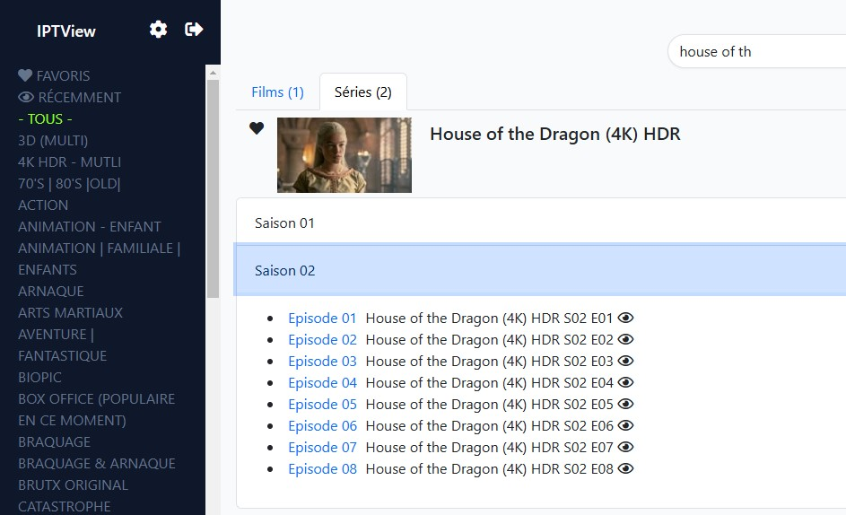
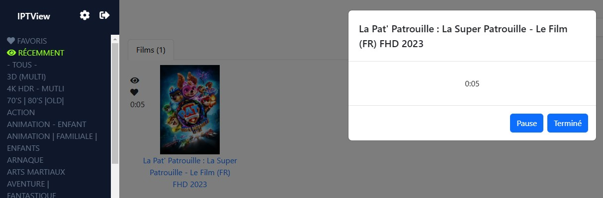

## Description

Web Interface to have your IPTV Server everywhere.

Features:
- use VLC for viewing the stream 
- added multiple playlists
- set your favorites movies, channels, series
- save the history by user
- memorize your position
- filter some categories to avoid this kind of movies in search.
- supported languages : en / fr

## Requirements
- Create a folder c:\iptv
- Copy file public\iptv_vlc.bat inside
- Launch public\iptv.reg 
- Install composer (https://getcomposer.org/download/)
- Install VLC (https://www.videolan.org/index.fr.html)

## Installation
- cp .env.example .env
- set your .env variables (user email, password, locale...) if needed
- composer install

Add your M3U playlist in .env on the M3U variable, 
then launch commands:
````
php artisan migrate --seed
php artisan refresh:playlist
````

### Don't forget to go to the settings page to get the method to open movies link for linux or windows.

##  TMDB Notation

You can set your tmdb api key (https://www.themoviedb.org) in your .env (TMDB_KEY)
to get movies informations like notes, votes...
Then launch : 
````
php artisan refresh:info
````

## Updating
Launch this commande to refresh your library:
````
php artisan refresh:playlist
php artisan refresh:info
````

## Screenshots






## Docker
Mapping port 8051 -> 80
Mapping volume yours -> /var/www
